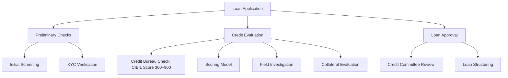

# Domain Understanding
NBFC - Non Banking Financial Companies

Loan Application -> Preliminary checks -> Credit Evaluation
                    Initial Screnning     Credit Bureau Check (CIBIL Score 300 - 900)
                    KYC Verification      Scoring Model

### Loan Application Flow

## Loan Application Workflow

Companies like experian or trans-union. These companies are called credit bureaus. They keep track of your credit history. They rank you based on your credit worthyness.
Now a financial companies will get data from these credit bureau companies and they will have there own scoring models and we are going to build these scoring models. 
Number of Open Accounts - Open Loan Account
Number of Closed Accounts - Closed Loan Account
Inquiry Count - Inquiry to Credit Buereu. Higher inquiry have neagative impact.
Credit Utilization Ratio - Loan Amount/Total Loan limit available
Deliquent Months - Missed payments of loan
Loan to income ratio - Loan Amount/Income  Also know as LTI
Days Past Due - DPD

Project Overview - This projects builds a Credit Risk Model. This model will include a credit scorecard that categorizes loan application into Poor, Average, Good and Excellent Categories based on criteria similar to CIBIL scoring system. 

Data Preprocessing - Pandas
Feature Engineering - Pandas, Statsmodel
Model Training - sckilt learn, XGBoost
Model Fine Tuning - Optuna
FrontEnd - Streamlit

